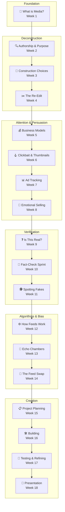

# 18-Week Media Literacy Curriculum

---

:::tip Use This Page
- Review [Curriculum Overview](#curriculum-overview) for pacing and teaching assumptions.
- Use [Program at a Glance](#program-at-a-glance) to jump to a specific week quickly.
- Check [Learning Ladder](#learning-ladder-how-skills-build-over-time) to see how concepts connect.
- Check [Optional Extension](#optional-extension) for the bonus track.
- Save [Independent Session Setup Tips](#independent-session-setup-tips) for caregiver logistics.
:::

:::info Planning Help
- Use this page as your roadmap before the course starts or whenever you need to find the right lesson quickly.
- The week-by-week table is the fastest way to jump into a teaching page.
- If you are new to this curriculum, start with the [Caregiver & Educator Guide](/docs/caregiver-guide).
:::

## Curriculum Overview

### Target Audience
Young learners (ages 8–12, with adaptations for ages 6–8 and extensions for ages 11–13).
Basic reading ability is helpful, but adult guidance is expected throughout.

### Weekly Structure
Each week contains:

- **Two guided sessions** (about 30 minutes each)
- **One independent session** (about 20–30 minutes)

Guided sessions introduce concepts through conversation, real examples, and hands-on activities.
Independent sessions reinforce skills through creative exploration, journaling, and purposeful practice.

Across the curriculum, students are regularly asked to explain what they notice, compare different examples, evaluate claims, and create their own media — building from analysis toward creation.

### Core Concepts

Five ideas thread through every unit. For a full explanation of each, see the [Welcome page](/docs/intro#core-concepts).

1. **All Media is Constructed**
2. **Follow the Incentive**
3. **Algorithms Shape What You See**
4. **Context Changes Meaning**
5. **Sharing Has Consequences**

These are simplified models designed for ages 8–12. Each one captures an important pattern, but the real world is more complex. The curriculum uses these as starting points for inquiry, not as final answers.

### Final Project

The program culminates in a student-created media project developed during Weeks **15–18**. Students plan, build, test, and present an honest media artifact with a clearly defined audience and purpose. See the [Final Project Rubric](/docs/final-project-rubric) for evaluation criteria.

### Flexibility & Adaptability

This curriculum is a **guide, not a rigid script**.

Adjust pacing based on the learner's:

- engagement
- confidence
- curiosity
- attention span

If a concept clicks quickly, explore optional challenges or extensions. If a topic needs more time, slow down and revisit through discussion or hands-on activities.

The ultimate goal is **critical thinking and confidence**, not rushing through content.

### What Makes This Different

- **This is not internet safety — it's a transferable thinking skill.** Internet safety programs focus on specific online dangers. This curriculum teaches a way of thinking that applies to any media — a news article, a billboard, a podcast, a textbook, or a social media post.
- **It's not about fear — it's about empowerment.** The goal isn't to make kids afraid of media. It's to give them the tools and confidence to navigate it well.
- **It includes creation, not just analysis.** Students don't just learn to critique — they build their own media projects, which deepens their understanding of how media works.
- **It works across settings.** The curriculum is designed for classrooms, homeschool families, libraries, after-school programs, and co-ops. The structure adapts to whoever is facilitating.

### Assessment Approach

This curriculum uses practical, lightweight assessment — no tests, no grades. Learning is tracked through:

- **Weekly Quick Checks** — 2–3 items at the end of each lesson
- **Caregiver Look-Fors** — observable signs in each week
- **Spiral Performance Tasks** — milestone activities at key intervals where students apply multiple skills to a single media artifact (see [Assessment Checkpoints](/docs/assessment-checkpoints))
- **Unit Checkpoints** — reflection conversations at the end of each unit (see [Assessment Checkpoints](/docs/assessment-checkpoints))
- **Pre/Post Self-Assessment** — a simple reflection tool at the start and end of the course (see [Self-Assessment](/docs/self-assessment))
- **The Final Project** — the most authentic evidence of learning (see [Final Project Rubric](/docs/final-project-rubric) and [Project Exemplars](/docs/final-project-exemplars))

### The Media Checkpoint

A seven-question analysis routine — [The Media Checkpoint](/docs/media-checkpoint) — runs through the entire course as a recurring thinking tool. Students begin with the first few questions in Week 1 and progressively add the rest, building toward automatic media analysis habits.

---

## Program at a Glance

Each week below links to a detailed lesson page containing:

- learning objectives
- key vocabulary
- guided sessions with activities
- independent activities
- preparation notes
- quick checks and adaptations

### The Anatomy of a Message — Weeks 1–4

| Week | Theme | Focus |
|---|---|---|
| [Week 1](./week01-week-1) | What IS Media? | Identifying media in daily life; understanding that all media is made by someone |
| [Week 2](./week02-week-2) | Who Made This and Why? | Authorship and purpose — informing, entertaining, persuading, selling |
| [Week 3](./week03-week-3) | The Invisible Choices | How camera angles, colors, music, and words change how a story feels |
| [Week 4](./week04-week-4) | The Re-Edit | Key Activity — editing the same material two ways to tell two different stories |

### The Attention Economy — Weeks 5–8

| Week | Theme | Focus |
|---|---|---|
| [Week 5](./week05-week-5) | The Price of Free | Business models behind free content — if it's free, ask what's paying for it |
| [Week 6](./week06-week-6) | The Clickbait Machine | How headlines and thumbnails are engineered to exploit curiosity |
| [Week 7](./week07-week-7) | The Ad Tracker | Key Activity — counting every persuasion attempt in an hour of media |
| [Week 8](./week08-week-8) | Selling Ideas | When media sells opinions, feelings, or behaviors instead of products |

### Verification & Debugging — Weeks 9–11

How to check information, trace claims, evaluate sources, and understand the difference between reporting, opinion, and entertainment.

| Week | Theme | Focus |
|---|---|---|
| [Week 9](./week09-week-9) | Is This Real? | Why false information spreads; types of content (news, opinion, entertainment, advertising); introduction to verification tools |
| [Week 10](./week10-week-10) | The Fact-Check Sprint | Key Activity — tracing a viral claim back to its original source; comparing how different sources cover the same event |
| [Week 11](./week11-week-11) | Spotting Fakes | Manipulated images, out-of-context media, and visual detection tools |

### The Algorithmic Echo — Weeks 12–14

How recommendation systems shape what you see, and how to broaden your view.

| Week | Theme | Focus |
|---|---|---|
| [Week 12](./week12-week-12) | How Does My Feed Know Me? | What algorithms are and how "liking" changes what gets shown next |
| [Week 13](./week13-week-13) | The Echo Chamber | Filter bubbles, confirmation bias, and why our brains prefer familiar ideas |
| [Week 14](./week14-week-14) | The Feed Swap | Key Activity — exploring a simulated feed from a completely different perspective |

### Intentional Production — Weeks 15–18

| Week | Theme | Focus |
|---|---|---|
| [Week 15](./week15-week-15) | The Spec Sheet | Planning a media project — audience, goal, format, and ethics |
| [Week 16](./week16-week-16) | Building Your Message | First draft — writing, recording, or designing the project |
| [Week 17](./week17-week-17) | Testing and Refining | Peer review, revision, and fact-checking your own work |
| [Week 18](./week18-week-18) | The Signal Broadcast | Final presentations and course reflection |

---

## Optional Extension

| Week | Theme | Focus |
|---|---|---|
| [Extension Week 1](./week-extension-1) | AI-Generated Media | Deepfakes, AI images, synthetic text — how to detect and think about AI-produced content |
| [Extension Week 2](./week-extension-2) | Journalism Deep Dive | How newsrooms work, editorial independence, advanced source comparison, and building a personal credibility framework |

---

## Learning Ladder: How Skills Build Over Time

Each layer of the curriculum builds on the previous one. Students begin by learning that all media is constructed, then explore how media makes money, how to verify it, how algorithms shape it, and finally how to create it responsibly.

The curriculum moves students from:

**media awareness → media analysis → media verification → media creation**

---

## Independent Session Setup Tips

Independent sessions work best when the learner has **clear visual instructions and a structured environment**.

Helpful strategies:

**1. Visual instruction cards**
Provide simple step-by-step guidance with icons or pictures.

**2. Visual timer**
A countdown timer helps learners manage the session independently.

**3. A simple "Help Card"**
Include common reminders: "Stuck? Try re-reading the question. Still stuck? Write down what's confusing and ask about it later."

**4. Achievement tracker**
A themed progress chart with stickers or checkmarks can make progress visible and motivating.

**5. Weekly show-and-tell**
After each independent session, spend 1–2 minutes letting the learner explain what they discovered or created.

---

## Materials for Independent Sessions

Helpful materials to prepare ahead of time:

- [Media Detective Notebook](/docs/media-detective-notebook) (one per student)
- Printed visual instruction cards (optional)
- Troubleshooting "Help Card"
- Achievement chart and stickers
- Tool reference sheets for activities like reverse image search
- Art supplies for creative activities

See the full [Materials List](/docs/materials) for week-by-week preparation details.

---

## Final Notes

This curriculum is designed to introduce children to **media literacy as a practical, empowering skill**.

Students will not just learn about media — they will learn to **question it, verify it, and eventually create it responsibly**.

By the end of the program, students will understand not just how to consume media — but how the media system works and how to navigate it with confidence and integrity.

Most importantly, they will build **confidence navigating an information landscape** — not through fear, but through understanding.
